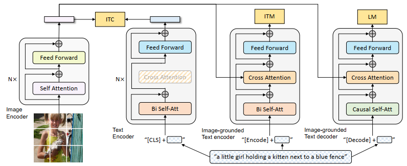

# VidCap
Video Captioning Using BLIP model  
> [📜paper](https://arxiv.org/abs/2201.12086v2)  
> [🤗HuggingFace](https://huggingface.co/Salesforce/blip-vqa-base)  
> [git](https://github.com/dino-chiio/blip-vqa-finetune/blob/main/finetuning.py)

## Process
1. Input video  
2. ```python main.py```  
3. Blip do caption every 15fps  
4. Save output to JSON  
  
  
  

## Output Example